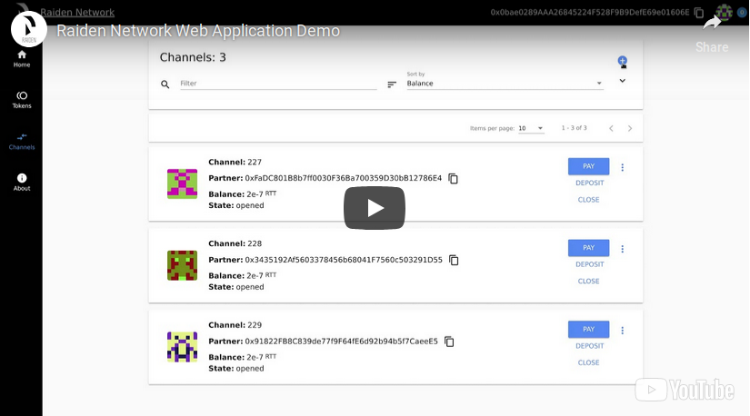

<!-- PROJECT SHIELDS -->

<h2 align="center">
  <br/>
  <a href='https://raiden.network/'></a>
  <br/>
  Raiden WebUI
  <br/>
</h2>

<h4 align="center">
  
</h4>

<p align="center">
  <a href="#getting-started">Getting Started</a> ∙
  <a href='#contact'>Contact</a>
</p>

<p align="center">
  <a href="https://pypi.org/project/raiden-webui/">
    
  </a>
  <a href="https://circleci.com/gh/raiden-network/webui/tree/master">
   
  </a>
  <a href="https://codecov.io/gh/raiden-network/webui">
    
  </a>
  <a href="https://github.com/prettier/prettier">
    
  </a>
  <a href="https://gitter.im/raiden-network/raiden">
    
  </a>
</p>

Raiden WebUI is a simple web application that utilizes the Raiden REST API endpoints to
allow the user to interact with token networks, make token payments, see the current status of open
channels along with closing and settling channels to name some of the functionality.

## Table of Contents

- [Table of Contents](#table-of-contents)
- [About The Project](#about-the-project)
- [Getting Started](#getting-started)
  - [Learn about Raiden](#learn-about-raiden)
  - [Using the WebUI](#using-the-webui)
  - [Prerequisites](#prerequisites)
  - [Development](#development)
    - [Configuration](#configuration)
    - [Running the WebUI](#running-the-webui)
    - [Python package](#python-package)
- [Contributing](#contributing)
- [License](#license)
- [Contact](#contact)

## About The Project

The [Raiden Network](https://raiden.network/) is an off-chain scaling solution, enabling near-instant,
low-fee and scalable payments. It’s complementary to the Ethereum blockchain and works with any ERC20 compatible token.

The Raiden client code is available [here](https://github.com/raiden-network/raiden) and has been
[released for mainnet](https://medium.com/raiden-network/red-eyes-mainnet-release-announcement-d48235bbef3c) with a
limited alpha release of the Raiden Network in December 2018.

<p align="center">
  <a href="https://www.youtube.com/watch?v=ASWeFdHDK-E" target="_blank">
    
  </a>
</p>


Raiden WebUI is built using the following technologies:

-   [Angular](https://angular.io/)
-   [Angular Material](https://material.angular.io/)
-   [Angular Flex-Layout](https://github.com/angular/flex-layout)
-   [Web3.js](https://github.com/ethereum/web3.js/)

## Getting Started

### Learn about Raiden

If you haven't used Raiden before, you can:

-   Checkout the [developer portal](http://developer.raiden.network)
-   Look at the [documentation](https://docs.raiden.network)
-   Learn more by watching explanatory [videos](https://www.youtube.com/channel/UCoUP_hnjUddEvbxmtNCcApg)
-   Read the blog posts on [Medium](https://medium.com/@raiden_network)

### Using the WebUI

If you want to learn how to use the Raiden WebUI an [updated tutorial](https://docs.raiden.network/the-raiden-web-interface) has been published in the new documentation for Raiden.

### Prerequisites

If you just want to use the WebUI all you need to do is install and run Raiden. A version of the WebUI comes bundled with each Raiden release and is accessible from `http://127.0.0.1:5001`.

For details on how to easily install Raiden:

Read the [Quick Start](https://docs.raiden.network/quick-start) section in the documentation.

If you want to work on the WebUI codebase you need:

-   Node >=10.13.0
-   A working [Raiden client](https://raiden-network.readthedocs.io/en/latest/overview_and_guide.html).
-   Git for version control.

### Development

Before you start working on the WebUI you need to install the WebUI dependencies.

```bash
npm install
```

#### Configuration

Before you begin to work on the WebUI you have to make sure that you have the proper configuration.
Check if the [proxy configuration](./proxy.config.json) corresponds to your actual environment configuration.

Since you will not be running the WebUI embedded into Raiden you need to provide both the Ethereum RPC endpoint
and the Raiden REST API endpoint to the `proxy.config.json`.

By default the configurations looks like this:

```json
{
    "/api": {
        "target": "http://localhost:5001",
        "proxyTimeout": 600000
    },
    "/web3": {
        "target": "http://localhost:8545",
        "pathRewrite": { "^/web3": "" },
        "changeOrigin": true,
        "proxyTimeout": 60000
    }
}
```

The configuration assumes that the Ethereum RPC endpoint listens on `http://localhost:8545`
and the Raiden REST API is on `http://localhost:5001`. If you are using a different configuration make sure
to update the corresponding fields in the configuration.

For example if you run Raiden on port `5002` and you use Infura as your RPC provider you would have to
modify the `proxy.config.json` to like like:

```json
{
    "/api": {
        "target": "http://localhost:5002",
        "proxyTimeout": 600000
    },
    "/web3": {
        "target": "http://goerli.infura.io/v3/YOUR_API_KEY",
        "pathRewrite": { "^/web3": "" },
        "changeOrigin": true,
        "proxyTimeout": 60000
    }
}
```

> **Info**: On development mode there is no way to guarantee that raiden and the RPC provider run on the same chain.
> You have to be careful, because if you start for example Raiden on Rinkeby and pass Görli as the RPC endpoint, WebUI
> will fail to work.

> **Important**: Modifications on `proxy.config.json` make sure never be part of your PR.

#### Running the WebUI

After you are done with the configuration you can start the development server:

```bash
npm run serve
```

After the development server starts you have to navigate to `http://localhost:4200/ui`, in order to use the WebUI.

#### Python package

The WebUI is build as a python package and it's available on PyPI. This package is pinned as a dependency on Raiden.
The PyPI package provides a precompiled version of the WebUI that is bundled with Raiden and can be used out of the box.

The python package provides a static variable that points to the location of the WebUI static content root directory.
This can be imported by raiden to expose the bundled WebUI resources:

```python
from raiden_webui import RAIDEN_WEBUI_PATH
```

The package can build the python package by calling:

```bash
python setup.py build sdist bdist_wheel
```

The command calls `npm build:prod` to build the static production version of the WebUI so
that it can get included in the python package.

If you need to install the package locally to your development virtual environment you can do
so by running:

```bash
python setup.py build install
```

In case you need to use the debug version of the WebUI with in your virtual environment you can also
run:

```bash
python setup.py compile_webui -D install
```

This will build the debug version of the WebUI to include in your package.

## Contributing

Contributions are what make the open source community such an amazing place to learn, inspire, and create. Any contributions you make are **greatly appreciated**.

Also have a look at the [Raiden WebUI Development Guide](./CONTRIBUTING.md) for more info.

## License

Distributed under the [MIT License](./LICENSE).

## Contact

Dev Chat: [Gitter](https://gitter.im/raiden-network/raiden)

Twitter: [@raiden_network](https://twitter.com/raiden_network)

Website: [Raiden Network](https://raiden.network/)

Mail: contact@raiden.network

Project Link: [https://github.com/raiden-network/light-client](https://github.com/raiden-network/light-client)
